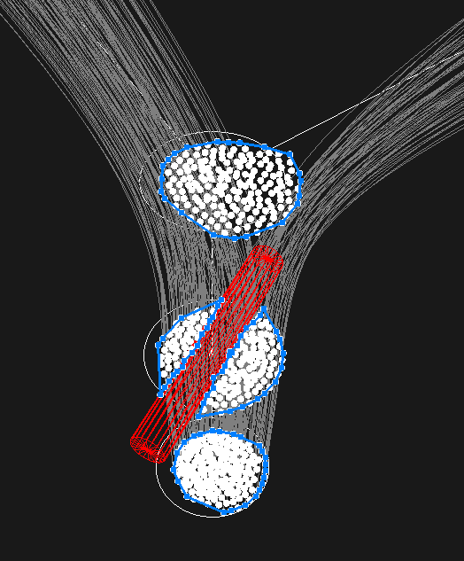
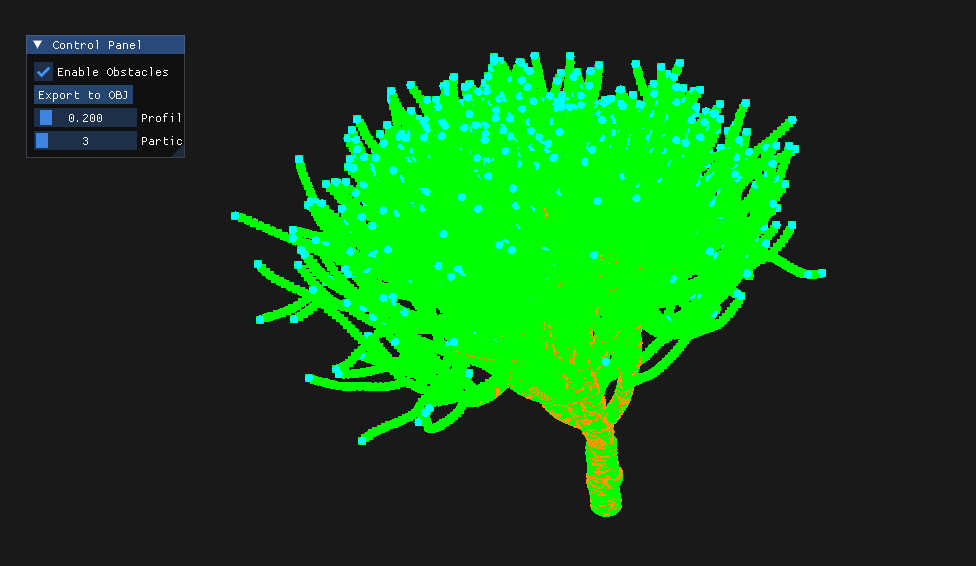
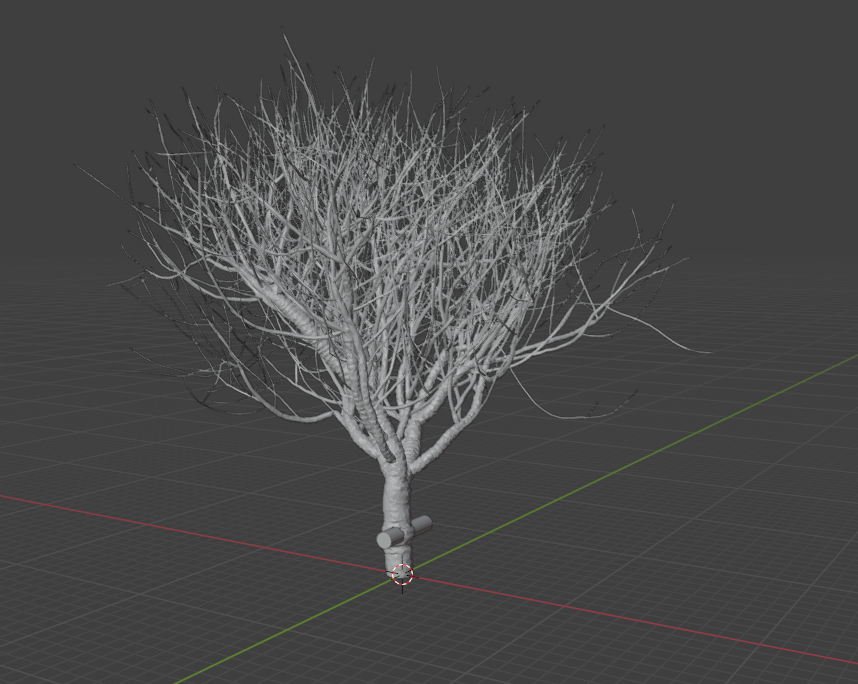
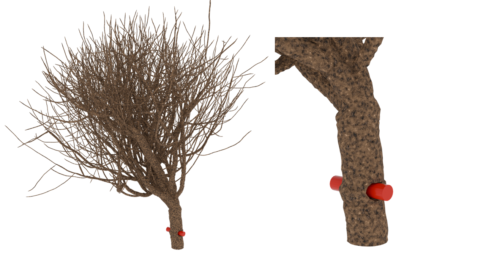

# 卒業研究テーマ
「障害物を考慮するストランドを用いた木のモデリング」

## 概要
CSV形式の木の骨格データと.obj形式の障害物モデルを入力として，障害物を飲み込んだ木のモデルを生成するシステムです．
OpenGLを用いて生成過程を確認し，最終的なメッシュを.obj形式で出力します．
設計から実装まで一人で担当しました．

## 実行結果

## 仕様技術
* **言語:** C++
* **グラフィックス:** OpenGL
* **主要ライブラリ:** CGAL, GLM
